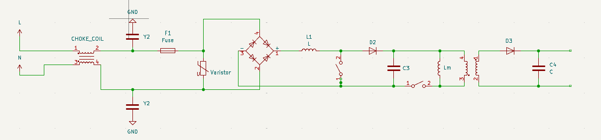

# Custom AC-DC Power Supply Design
> This project focuses on the design, simulation, and hardware development of a highly efficient and robust AC-DC Power Supply.
> 
> ⚠️ **Disclaimer:** Please note that comprehensive technical details, specific component values, stress analysis calculations, and complete circuit schematics have been intentionally omitted from this public repository for academic confidentiality and intellectual property reasons.
---
## Phase 1: Schematic Design & Power Conversion
The primary objective of this project is to develop a reliable AC to DC power conversion system. The architecture encompasses multiple crucial stages to ensure clean, stable, and safe power delivery, starting from the high-voltage AC mains input down to the regulated DC output.
To achieve robust performance and meet safety standards, the front-end of the schematic includes a comprehensive **EMI Filter** utilizing a choke coil and Y2 safety capacitors to suppress both common-mode and differential-mode noise. Furthermore, varistors are incorporated into the design for transient overvoltage and surge protection. The core AC-to-DC conversion is handled by a full-bridge rectifier stage, which is subsequently followed by a carefully calculated **LC output filter** designed to drastically minimize the DC voltage ripple.

  
   
  <em><b>Figure 1:</b> The primary circuit schematic of the AC-DC Power Supply, modeled and simulated in OrCAD/PSpice.</em>

